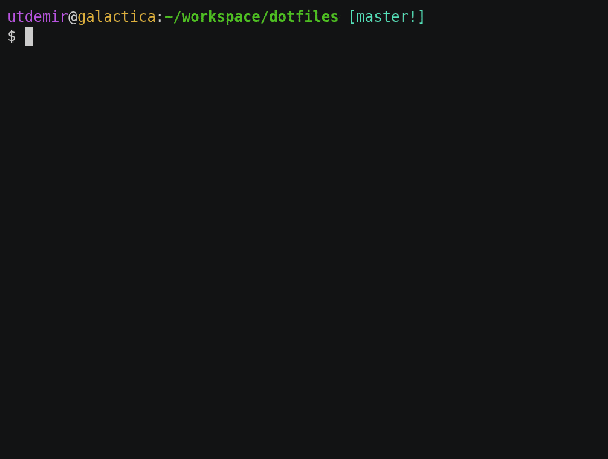

# zsh-sticky-prefix

Recently it started to bother me that that I spend a lot of time writing the same command many times just to give it different arguments, eg:

```bash
$ git status
$ git add somefile
$ git commit -m "did stuff"
$ git push
```

or

```bash
$ kubectl get pod
$ kubectl get pod somepod
$ kubectl get pod somepod -o yaml
```

Hence I wrote this really short snippet to make this faster. Here is a screencast:



Just paste this to your '.zshrc' to have it:

```bash
# zsh-sticky-prefix

local zle_sticked=""

zle-line-init() {
    BUFFER="$zle_sticked$BUFFER"
    zle end-of-line
}
zle -N zle-line-init

function zle-set-sticky {
    zle_sticked="$BUFFER"
    zle -M "Sticky: '$zle_sticked'."
}
zle -N zle-set-sticky
bindkey '^S' zle-set-sticky

function accept-line {
    if [[ -z "$BUFFER" ]] && [[ -n "$zle_sticked" ]]; then
        zle_sticked=""
        echo -n "\nRemoved sticky."
    fi
    zle .accept-line
}
zle -N accept-line
```

It saved a lot of time for me, maybe it'll be useful to you too. Please send a PR if you make it nicer. I might make this a proper zsh plugin in future.
